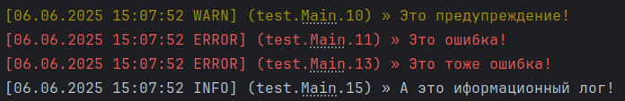

    ███╗   ██╗ ███╗   ██╗   ███████╗ ██████╗  ██╗ ████████╗ ██╗  ██████╗  ███╗   ██╗
    ████╗  ██║ ████╗  ██║   ██╔════╝ ██╔══██╗ ██║ ╚══██╔══╝ ██║ ██╔═══██╗ ████╗  ██║
    ██╔██╗ ██║ ██╔██╗ ██║   █████╗   ██║  ██║ ██║    ██║    ██║ ██║   ██║ ██╔██╗ ██║
    ██║╚██╗██║ ██║╚██╗██║   ██╔══╝   ██║  ██║ ██║    ██║    ██║ ██║   ██║ ██║╚██╗██║
    ██║ ╚████║ ██║ ╚████║   ███████╗ ██████╔╝ ██║    ██║    ██║ ╚██████╔╝ ██║ ╚████║
    ╚═╝  ╚═══╝ ╚═╝  ╚═══╝   ╚══════╝ ╚═════╝  ╚═╝    ╚═╝    ╚═╝  ╚═════╝  ╚═╝  ╚═══╝
    Разработчик в вк/тг/дс/гитхаб - @nnikitochka
    Дискорд сообщество https://dsc.gg/nnedition
    Телеграм канал https://t.me/nnedition

---

## 📦 Немного информации

YetAnotherLogger - это легковесный логгер написанный на `kotlin`, реализующий интерфейс `slf4j-api`, без дополнительных зависимостей и сложных конфигураций.
Он идеально подходит для небольших проектов, учебных целей или ситуаций, когда требуется простое решение для логирования без использования сторонних библиотек.

---

## 🚀 Начало работы

Выберите подходящею версию из доступного [списка версий](https://github.com/nnikitochka/YetAnotherLogger/releases) и добавьте зависимость в ваш проект:

### Gradle

Добавьте следующие зависимости в ваш `build.gradle.kts`:

```kt
repositories {
    mavenCentral()
    maven("https://jitpack.io")
}

dependencies {
    implementation("org.slf4j:slf4j-api:2.0.17")
    implementation("com.github.nnikitochka:YetAnotherLogger:Тэг")
}
```


### Maven

Добавьте следующие зависимости в ваш `pom.xml`:

```xml
<repositories>
    <repository>
        <id>jitpack.io</id>
        <url>https://jitpack.io</url>
    </repository>
</repositories>

<dependencies>
    <dependency>
        <groupId>org.slf4j</groupId>
        <artifactId>slf4j-api</artifactId>
        <version>2.0.17</version>
    </dependency>
    <dependency>
        <groupId>com.github.nnikitochka</groupId>
        <artifactId>YetAnotherLogger</artifactId>
        <version>Тэг</version>
    </dependency>
</dependencies>
```

### Использование

Пример использования логгера:

```kotlin
import nn.edition.yalogger.LoggerFactory

object Main {
    val logger = LoggerFactory.getLogger("Main")

    @JvmStatic
    fun main(args: Array<String>) {
        logger.warn("Это предупреждение!")
        logger.error("Это ошибка!")

        System.err.println("Это тоже ошибка!")

        println("А это иформационный лог!")
    }
}
```

Вывод программы:


### Настройка

Настройка логгера происходит через статические методы класса `LoggerFactory`

---

## TODO:
- [ ] Сохранение логов в файл
- [ ] Придумать описание для LoggerFactory#terminalWriter